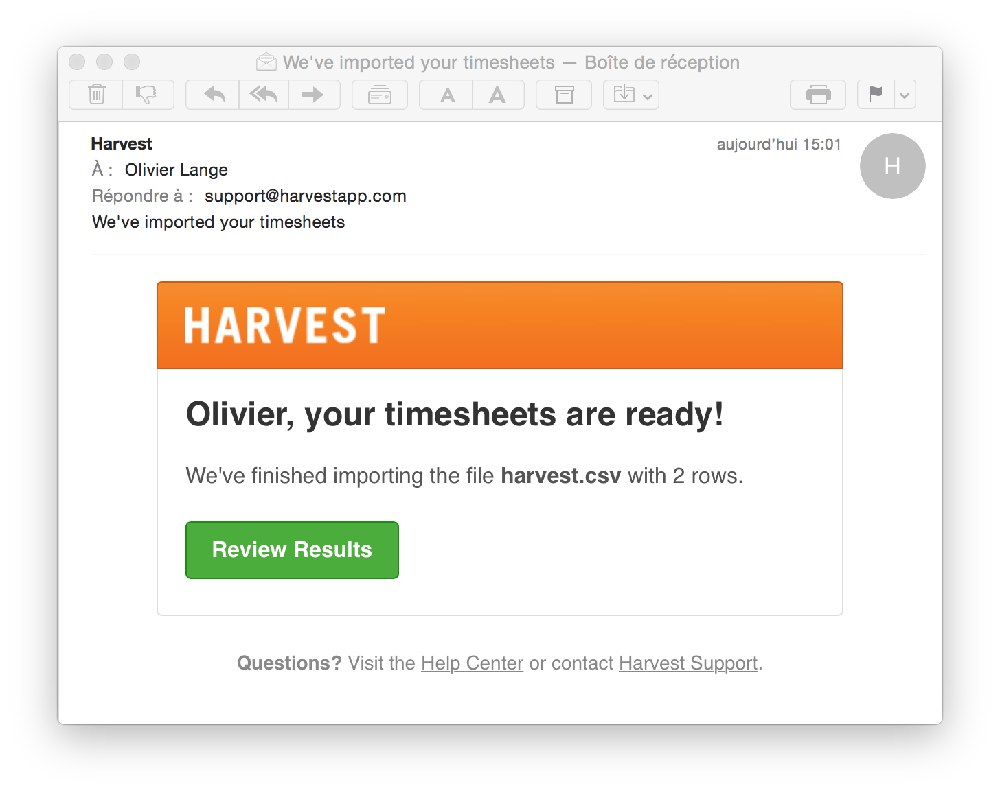

# Hamster to Harvest

A utility script written in Clojure to migrate [Hamster](http://projecthamster.wordpress.com/about/) time tracking entries to the [Harvest](https://www.getharvest.com) time tracking web service, from an XML export to a CSV file, that can be imported online.

## Status

Work in progress. Pre-alpha stage. Look at the [develop](https://github.com/olange/hamster-to-harvest-csv/tree/develop) branch.

## Usage

First export the activites from Hamster in XML format.

Then convert them to Harvest time tracking entries in CSV format:

    $ java -jar hamster-to-harvest-0.1.0-standalone.jar hamster.xml > harvest.csv

And upload them to your Harvest account; from the web interface:

* navigate _Company Settings_ › _Import Data into Harvest_ › _Import Timesheets From CSV_
* select the `harvest.csv` file, and click _Upload and Import_

You'll shortly receive an e-mail from Harvest, with a link to the results of the import:

## Caveat

The _Started at_, _Ended at_ and _Billed?_ fields of Harvest cannot be set thru the CSV Import feature. So you'll loose the `start_time` and `end_time` fields available in Hamster activities.

## Compiling and assembling

If you're new to Clojure, here's how to get started hacking this project.

Prerequisites:

* you'll need a [Java SDK](http://www.oracle.com/technetwork/java/javase/downloads/index.html) (1.6+)
* and [Leiningen](http://leiningen.org/#install) installed on your computer.

To download all required dependencies (needed once only) and compile the sources:

    $ lein deps
    $ lein compile

To run the application from the command-line:

    $ lein run -- hamster.xml

To package the application as a self-contained JAR file:

    $ lein uberjar

To hack from the REPL:

    $ lein repl
    hamster-to-harvest.core=> (require '[hamster-to-harvest.core] :reload-all)
    hamster-to-harvest.core=> (-main "hamster.xml")

## License

 Hamster to Harvest (CSV) by <a xmlns:cc="http://creativecommons.org/ns#" href="http://github.com/olange" property="cc:attributionName" rel="cc:attributionURL">Olivier Lange</a> is licensed under a <a rel="license" href="http://creativecommons.org/licenses/by-sa/4.0/">Creative Commons Attribution-ShareAlike 4.0 International License</a>.
 Permissions beyond the scope of this license may be available at <a xmlns:cc="http://creativecommons.org/ns#" href="https://github.com/olange/hamster-to-harvest-csv/issues/new" rel="cc:morePermissions">github.com/hamster-to-harvest-csv/issues</a>.
